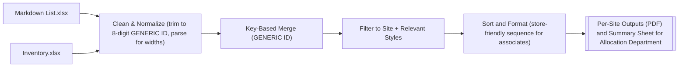
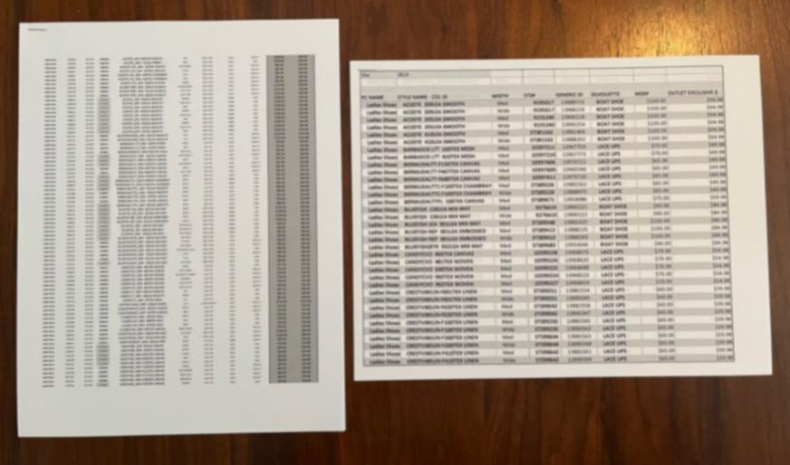

# Store Specific Markdowns Project

## 📌 Overview
This project automates Store Specific price change list creation for retail stores.  
Managers previously had to manually cross-check price changes in MIM (Merchandise Inventory Management); I built a Python solution that:
- Matches store inventory with corporate markdown lists
- Produces store-specific markdown files
- Saves hours of manual effort across the fleet

This presentation was created to pitch the project to the Allocation Department and gain approval.
[📑 View the Presentation to the Allocation Department (PDF)](../assets/Inventory%20Markdown%20Merge%20Project.pdf)

---

## ⚙️ Tech Stack
- **Python (pandas, openpyxl, matplotlib)**
- **Excel automation**
- **PDF generation (matplotlib + reportlab)**
- **Microsoft Powerpoint**

---

## 🔑 Key Features
- Automatically matches markdowns against current store inventory
- Generates Excel and PDF reports per store
- Groups by **site**, **style**, **width**, and **price**
- Adds **summary sheet** with per-site markdown % and averages to show impact.

---

## 📊 What This Project Does (No Data Shared)

The example is blurred for confidentiality reasons, but you can easily tell one is easier to read than the other. It also went from 500 lines to an average of 160 lines per store.

---

## 📂 Files
- [`retail_markdowns.ipynb`](../assets/Inventory%20Markdown%20Merge%20Final.ipynb) → Main Jupyter Notebook (end-to-end pipeline with code + outputs)
- Example markdown reports in `/assets`

---

## 🔗 Back to Portfolio
[← Return to main portfolio](../README.md)
